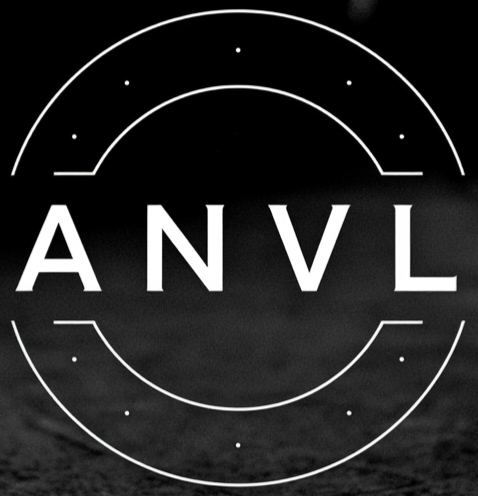

# Anvil — The Final Data Language  
**ANVL · Version 0.5.0-alpha · June 23, 2026**  

**Private Repository · Reference Implementation in Pure C**



**A**ttributed **N**ode **V**ariadic **L**anguage

> “JSON died so Anvil could live.”  
> ~ Badkraft, 2025

Anvil is not another config format.  
Anvil is the **end** of config formats.  
Anvil is not just another language.  
Anvil is a paradigm shift in data structure, object modelling, and messaging.  

 · Zero-copy · Typeless · Human-first · Fast is an understatement ·  
 · Multi-dialect (AML, AMP, ASL-**implemented (alpha)**) · Standalone build — zero external deps ·  
 · Perfect round-tripping · Resolver-**complete** · Schema-**complete** · AMP arrays/tuples-**complete** ·  
 · UDP-friendly · **Parser holds zero payload data — zero attack surface** ·  
  
### Built to replace every legacy data and configuration language in existence.

This repository contains the **reference implementation of Anvil in pure C**. We will be planning and executing bindings/wrappers in at least 6 other languages or platforms:
- C++
- C#/.Net
- Java
- Python
- Rust
- Node

---

## The Case for Anvil

### One Parser. Three Complete Layers.

Every distributed system has three data problems: *modeling*, *transport*, and *behavior*. Most stacks answer each with a different language, a different parser, a different security model, and a different failure mode.

Anvil collapses all three into one language, one grammar, one parser:

| Dialect | Shebang | Problem It Solves | Replaces |
|---------|---------|-------------------|---------|
| **AML** | `#!aml` | Declarative data modeling and configuration | JSON, YAML, TOML, XML |
| **AMP** | `#!amp` | Structured messaging and transport | MQTT, AMQP, protobuf wire formats |
| **ASL** | `#!asl` | Embedded scripting and behavior automation *(v0.4.0)* | Lua, inline eval loops |

The dialect is declared on the first line. The parser enforces it immediately. No runtime modes, no flags, no separate parsers.

### The Parser Has No Attack Surface.

The parser's entire internal state is integers — byte offsets and lengths into the buffer you provide. No string is ever copied. No content is buffered inside the parser at any point.

Blob payloads are skipped entirely: the parser records where a blob starts and how long it is, then moves on **without reading a single byte of content**. Under adversarial conditions — heap dump, memory probe, fuzzer, timing side-channel — the parser cannot expose payload data because it holds none.

Forbidden constructs (in AMP: objects, attributes, inheritance, imports) are rejected at parse time with no additional runtime guard layer. The parser is not a liability in the trust chain. This is not a performance claim — it is a security property.

### Runs on Any Transport. Including UDP.

AMP messages carry their own fragmentation metadata at the application layer — no transport header changes required:

```
#!amp
parts    := (1, 3)              // fragment 1 of 3
msg_id   := "a3f9"              // correlates fragments at reassembly
payload  := @aes256-gcm`...`   // this fragment's ciphertext
```

AMP is equally at home on TCP, UDP, WebSocket, serial, or a message queue. The protocol does not know or care about transport. Delivery is the consumer's problem by design — and that constraint is what makes it deployable everywhere.

---

## Repository Structure

```
anvil/
├── include/
│   ├── anvil.h              ← public API entry point
│   ├── context.h            ← Context, Source, CtxBuilder interfaces
│   ├── types.h              ← statement, value, field, attribute structs
│   ├── errors.h             ← error codes and error state
│   ├── resolver.h           ← inheritance resolver API
│   ├── schema.h             ← schema validation API
│   ├── vars.h               ← vars resolution API
│   ├── import.h             ← multi-file import API
│   ├── serializer.h         ← round-trip writer API
│   ├── sigma.core/          ← embedded: types, allocator, strings interfaces
│   └── sigma.memory/        ← embedded: bump arena + Allocator vtable
├── src/
│   ├── core/                ← parser, context, errors, memory, strings, utils
│   ├── resolver/            ← anvil.resolver.o — inheritance graph
│   ├── schema/              ← anvil.schema.o   — type validation
│   ├── vars/                ← anvil.vars.o     — var resolution
│   ├── import/              ← anvil.import.o   — multi-file imports
│   ├── serializer/          ← anvil.serializer.o — round-trip writer
│   └── asl/                 ← anvil.asl.o      — AnvilScript parser + evaluator
├── test/
│   └── unit/                ← TestBit-based unit tests (active quality gate)
├── bindings/
│   ├── node/                ← official Node/N-API binding workspace
│   ├── python/              ← official Python binding workspace
│   ├── dotnet/              ← official .NET binding workspace
│   ├── scripts/             ← shared binding maintenance/handoff scripts
│   └── Makefile             ← bindings generation/signoff orchestration
├── docs/                    ← language spec, AMP guide, schema authoring
├── config.sh                ← bash build configuration
└── README.md
```

Bindings maintenance policy and sign-off checklist:

- `docs/maintainers/bindings-maintenance.md`
- `docs/maintainers/bindings-signoff-checklist.md`

## Module Architecture

Anvil is designed as a single C backend with pluggable layers. All bindings
(Node.js, Python, .NET, etc.) link against the same C modules.

```
┌─────────────────────────────────────────────────────┐
│  Default lib (always shipped together)               │
│  anvil.o + anvil.resolver.o + anvil.vars.o           │
│  + anvil.import.o                                    │
├─────────────────────────────────────────────────────┤
│  Optional modules (linked when needed)               │
│  anvil.schema.o    — schema validation               │
│  anvil.serializer.o — round-trip writer              │
│  anvil.asl.o — AnvilScript parser + evaluator        │
├─────────────────────────────────────────────────────┤
│  Language bindings (per-paradigm wrappers)           │
│  Anvil.JS (Node) · Anvil.PY · Anvil.Net · Anvil.J   │
└─────────────────────────────────────────────────────┘
```

**Dependency rule:** `anvil.schema` → `anvil.resolver` → `anvil.o`. Nothing flows upward. The parser knows nothing about schema, scripting, or bindings.

## Core Principles (Non-Negotiable)

| Principle                         | Status |
|-----------------------------------|---------|
| Attitude ... because it's earned | Locked |
| Zero-copy parsing, spans into original buffer | ✅ Locked |
| Lexerless, forward-only, disciplined forward discovery | ✅ Locked |
| Parser holds zero payload data — zero attack surface | ✅ Locked |
| No external dependencies — fully standalone C build | ✅ As of v0.5.0 |
| No macros except literal constants | ✅ Locked |
| No CMake. Bash build scripts until AnvilBuild exists | ✅ Locked |
| C23 default, C11 fallback only when forced | ✅ Locked |
| All bindings share the same C backend | ✅ Architecture locked |

## Dialects

One language. One parser. Three dialects — activated by shebang on the first line.

| Dialect | Shebang | Domain | Status |
|---------|---------|--------|--------|
| **AML** | `#!aml` | Declarative data modeling — replaces JSON, YAML, TOML | ✅ Complete |
| **AMP** | `#!amp` | Cipher-agnostic structured messaging — UDP-friendly, zero parser attack surface | ✅ Complete |
| **ASL** | `#!asl` | Lightweight imperative scripting — embedded behavior automation | ✅ Implemented (alpha) |

## Current State (v0.5.0-alpha)

### Parser (anvil.o)
- AML: statements, objects, arrays, tuples, blobs, attributes, inheritance, anonymous blocks
- AMP: scalar arrays/tuples, blob encoding, all object/attribute/import restrictions enforced
- Vars block: `vars { key := value }` — stored in `ctx->vars_list`
- Imports: `import "path"` and `import "path" as alias` — stored in `ctx->import_list`
- Using declarations: `using <module>` — escalates AML → ASL; stored in `ctx->using_list`
- VarRef: `$identifier` — zero-copy identifier span
- Interpolated strings: `$"…{ident}…"` — segment list (literal + ref spans)
- Anonymous blocks: `identifier { }` and `identifier @[attrs] { }` — optional decoration
- Quote stripping: scalar `pos/len` points inside the quotes (consumers see raw content)
- Error codes: full 4xxx range with line/column reporting

### Resolver (anvil.resolver.o)
- Kahn's topological sort — cycle detection with ANVL_ERR_RESOLVER_CYCLE_DETECTED
- Lazy merged-field access with per-statement cache
- Forward references: base may be declared after derived
- Custom merge policy API: `anvl_merge_policy_fn` callback for array concat, deep merge, etc.
- Rejects inheritance from anonymous blocks
- `warm_all()` for eager pre-computation

### Schema (anvil.schema.o)
- Resolves `.asch` documents: Object, Enum, Flags type declarations
- `@[schema]` module attribute triggers schema context (detected by schema module, not parser)
- Multi-error validation: collects all errors before returning
- Error codes: 4601–4606 (missing attr, unknown base, required field, type mismatch, etc.)
- FlyWire-ready core is available now: `Schema.resolve`, `Schema.get_type`, and `Schema.validate` are shipped and tested in active C suites
- Roadmap item `0.6.0-alpha` refers to formal FlyWire pipeline tooling (packaging/workflow/deep integration), not first-time schema availability

### Vars (anvil.vars.o)
- `Vars.build()` — resolves VarRef chains, detects circular references
- `Vars.resolve()` — key lookup by name
- `Vars.materialise_interp()` — expands `$"…{ref}…"` to a heap string

### Import (anvil.import.o)
- Multi-file import graph with transitive resolution
- Cross-source statement lookup, VarRef resolution, inheritance
- Cycle detection in import graph

### Serializer (anvil.serializer.o)
- Round-trip writer: context → ANVL text
- Pretty and minified output
- AMP dialect enforcement

### Testing
- TestBit: zero-dependency C test runner (`extern const testbit_i TestBit`)
- Active TestBit suites are wired in `test/unit/Makefile` and used as the supported quality gate
- Current local runs in this branch are passing for resolver, vars, interpolation, using, schema, and anonymous-block attributes
- Valgrind target remains clean for active suites

AMP is the only messaging protocol whose parser holds no payload data at any point during parsing — not a performance optimization, a security property. See [docs/amp.md](docs/amp.md) for the full specification, security customization guide, and UDP fragmentation pattern.

## Bindings Status

| Binding     | Language      | Status                    |
|-------------|---------------|---------------------------|
| Anvil.JS    | Node.js       | **Next** — in planning    |
| Anvil.Net   | C# / .NET 9   | Separate repo (v1.7.0)    |
| Anvil.PY    | Python 3.12+  | Planned                   |
| Anvil.J     | Java 21+      | Planned                   |
| Anvil.CPP   | C++20/23      | Planned                   |
| Anvil.R     | Rust          | Planned                   |

All bindings wrap the same C backend. The binding's job is idiomatic exposure — not reimplementation.

## Performance Metrics

Measured on Linux x86-64, `-O0 -g` (debug build), sigma.memory 0.2.5 resource-scope bump allocator.
All parse times are single cold-parse wall-clock. Throughput is file size / parse time.

### Parse throughput (single parse, cold)

| File                     | Size   | Parse time | Statements | Throughput    |
|--------------------------|--------|------------|------------|---------------|
| `assignments.anvl`       | 461 B  | ~11 µs     | 15         | ~40 MB/s      |
| `objects.anvl`           | 391 B  | ~11 µs     | 3          | ~34 MB/s      |
| `inherits.anvl`          | 448 B  | ~10 µs     | 2          | ~43 MB/s      |
| `attributes.anvl`        | 660 B  | ~13 µs     | 3          | ~47 MB/s      |
| `arrays.anvl`            | 1.2 KB | ~12 µs     | 5          | ~97 MB/s      |
| `tuples.anvl`            | 344 B  | ~7 µs      | 3          | ~45 MB/s      |
| `modpack.anvl`           | 7.0 KB | ~128 µs    | 32         | ~54 MB/s      |
| `deep_nesting.anvl`      | 1.8 KB | ~2.4 µs    | 0          | ~726 MB/s     |
| `complex_nested.anvl`    | 3.1 KB | ~2.2 µs    | 0          | ~1,350 MB/s   |
| `repetitive_data.anvl`   | 3.7 KB | ~2.8 µs    | 0          | ~1,265 MB/s   |
| `blob_heavy_mixed.anvl`  | 1.5 KB | ~2.0 µs    | 0          | ~700 MB/s     |
| `blob_heavy_json.anvl`   | 1.2 KB | ~2.3 µs    | 0          | ~513 MB/s     |

### Summary metrics

| Metric                          | Java POC  | C v0.1.x (pre-FT-12) | C v0.2.x (FT-12, Resource scope) | Target v1.0 |
|---------------------------------|-----------|----------------------|----------------------------------|-------------|
| 8 KB config parse               | ~25 µs    | ~159 µs              | **~128 µs** (-19%, debug build)  | < 10 µs     |
| Simple array parse (1.2 KB)     | —         | ~159 µs              | **~12 µs** (13× faster)          | —           |
| Simple tuple parse (344 B)      | —         | ~78 µs               | **~7 µs** (11× faster)           | —           |
| Blob / pass-through files       | —         | —                    | **~2 µs** / 500–1,350 MB/s       | —           |
| Heap allocations (hot path)     | 0         | 0                    | **0**                            | 0           |
| Allocator                       | JVM GC    | sigma.memory Arena   | **sigma.memory Resource (mmap bump)** | —      |
| Alloc cost per node             | GC amort. | O(1) R7 bump         | **O(1) bump, zero R7 coupling**  | O(1)        |
| Memory peak (7 KB parse)        | < 64 KB   | < 64 KB              | **≤ 28 KB** (4× src_len slab)    | < 32 KB     |

> **sigma.memory team note:** FT-12 (`Allocator.Resource` scope) eliminated all BTree/skiplist overhead from
> parse-time allocation. Prior to FT-12, `SCOPE_POLICY_FIXED` incorrectly routed through MTIS; with Resource
> scopes every allocation is a pure pointer-bump into an mmap slab. Array/tuple parse is 11–13× faster as a
> direct result. Blob and pass-through files already bypassed allocation entirely and are unchanged.
> Measured at `-O0`; release builds (`-O2`) expected to improve further.

## Roadmap

| Milestone              | Target     | Content                                                | Status |
|------------------------|------------|--------------------------------------------------------|--------|
| Anvil 0.1.0-alpha      | Dec 2025   | Pure C parser (AML, AMP), zero memory leaks            | ✅ Released |
| Anvil 0.2.x-alpha      | Mar 2026   | Inheritance resolver, writer, import graph             | ✅ Released |
| Anvil 0.4.0-alpha      | Mar 2026   | ASL parser + evaluator                                 | ✅ Released |
| Anvil 0.5.0-alpha      | Jun 2026   | Standalone build, parser parity, schema, TestBit       | ✅ Released |
| Anvil.JS binding       | Q3 2026    | Node.js binding — first language wrapper               | 🔜 Next |
| Anvil 0.6.0-alpha      | Q3 2026    | FlyWire formal schema pipeline, vars deep-path resolution | ❌ Planned |
| Anvil 0.7.0-alpha      | Q4 2026    | ASL hardening + module dispatch expansion              | ❌ Planned |
| AnvilBuild 1.0         | TBD        | Build system written in ASL using `.anvl` config       | ❌ Planned |
| Anvil 1.0              | TBD        | Full AML/AMP/ASL, all official bindings                | ❌ Planned |

---

> “We didn’t open-source Anvil. For a good reason ...
> - You want a data structure? ANVL
> - You want a message packet? ANVL
> - You want a minifiable configuration? ANVL
> - You want a secure, encrypted envelope? ANVL
> If Anvil cannot give you the data structure you want, you don't need the structure.
>
> We didn't just create a variadic structure for you data ... we weaponized your data.”
>
> ~ Badkraft · December 2025

Welcome to the future.  
Your data will never be the same.

---

## License

**Copyright © 2025 Quantum Override. All rights reserved.**

This software is proprietary and confidential. Unauthorized copying, distribution, modification, or use of this software, via any medium, is strictly prohibited without express written permission from the copyright holder.

Anvil is available under a tiered commercial license:

| Tier | Includes |
|------|----------|
| **Tier 1 — Core** | Anvil parser (`anvil.o`), all dialect support (AML, AMP, ASL), public API headers |
| **Tier 2 — Security** *(add-on)* | `anvil.security.o`, AMP Secure Packet specification, cipher registry API, `@amp.*` tag namespace |

See [LICENSE.txt](LICENSE.txt) for terms. `[TODO]` Full commercial license terms to be published.

[`anvil-engine`]: https://github.com/TheBadkraft/anvil-engine
