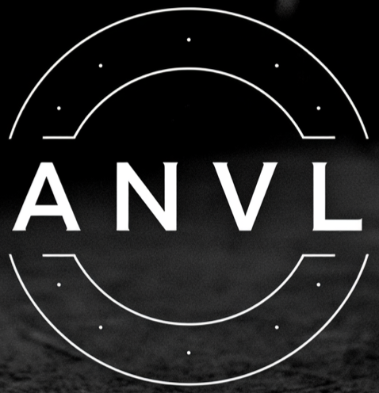

# Anvil — The Final Data Language
**ANVL · Version 0.7.0-alpha**

**Private Repository · Reference Implementation in Pure C**



**A**ttributed **N**ode **V**ariadic **L**anguage

> "JSON died so ANVL could live."
> ~ Badkraft, 2025

Anvil is not another config format. Anvil is a single language, one grammar, one parser, that
answers three problems most stacks solve with three different tools: declarative data modeling,
structured messaging, and (eventually) embedded scripting.

---

## Status, honestly

This README used to claim more than the codebase actually did. Fixed now — everything below
reflects what's real and verified today, not what's planned.

| Piece | Status |
|---|---|
| **AML** (`#!aml`) — declarative data modeling | ✅ Complete |
| **AMP** (`#!amp`) — structured messaging, zero parser attack surface | ✅ Complete |
| **Resolution** — `$identifier` VarRef, `base`/inheritance, field-merging | ✅ Complete |
| **Public C API** — `anvil_flat.h` (flat) + `anvil_vtable.h` (vtable) | ✅ Complete |
| **Opt-in type system** (`@[types]`, `anvil_types.c`) | ✅ Implemented, first phase |
| **Schema** (`@[schema]`, validating a document's shape) | 🔧 Actively being designed — not implemented yet |
| **ASL** (`#!asl`) — embedded scripting | 📝 Design only — nothing implemented |

## The Case for Anvil

### One Parser. Multiple Problems.

| Dialect | Shebang | Problem It Solves | Replaces |
|---------|---------|--------------------|----------|
| **AML** | `#!aml` | Declarative data modeling and configuration | JSON, YAML, TOML, XML |
| **AMP** | `#!amp` | Structured messaging and transport | MQTT, AMQP, protobuf wire formats |
| **ASL** | `#!asl` | Embedded scripting and behavior automation *(design stage)* | Lua, inline eval loops |

The dialect is declared on the first line and enforced immediately — no runtime modes, no flags,
no separate parsers.

### The Parser Has No Attack Surface.

The parser's internal state is integers — byte offsets and lengths into the buffer you provide.
No string is ever copied during parsing. Blob payloads are skipped entirely: the parser records
where a blob starts and how long it is, then moves on without reading a single byte of content.
Under adversarial conditions — heap dump, memory probe, fuzzer, timing side-channel — the parser
cannot expose payload data because it holds none.

AMP forbids objects, attributes, inheritance, and imports outright, rejected at parse time with
no separate runtime guard layer.

### Weakly Typed by Default. Strongly Typed When You Opt In.

AML/AMP's default is a weak type system — `foo := 42;` is just a numeric value with no declared
shape. On top of that, Anvil now has a native, opt-in type system: define a reusable, named,
constrained type once (`VIN := { type := String; size := 17; };`), reference it from anywhere
that imports the file that defines it. Nothing about opting in changes the default for anyone who
doesn't. See [`docs/types-reference.md`](docs/types-reference.md) for the full reference.

Schema (validating a *data* document's shape against declared field types) builds on the same
type system and is the current active design/implementation effort — see
[`notes/native-schema.md`](notes/native-schema.md) for the design record.

---

## Repository Structure

```
anvil/
├── include/
│   ├── anvil.h                  ← internal umbrella header
│   ├── anvil_flat.h             ← public API — flat function calls
│   ├── anvil_vtable.h           ← public API — vtable convenience layer
│   ├── anvil_types.h            ← public ABI types (opaque handles, stable enums)
│   ├── anvil_type_registry.h    ← public API — opt-in type registry
│   ├── errors.h                 ← public error codes
│   ├── internal/                ← internal-only headers (module, parser, source, ...)
│   └── sigma/                   ← vendored Sigma collections subset (types, allocator, list, map, ...)
├── src/
│   ├── core/                    ← parser, resolver, document, module, source, errors
│   ├── sigma/                   ← vendored Sigma collections implementation
│   └── anvil_types.c            ← opt-in type registry — part of ANVL proper, not an add-on
├── test/
│   ├── unit/                    ← TestBit-based unit suites (the supported quality gate)
│   ├── sigma/                   ← Sigma-subset unit suites
│   └── fixtures/                ← .anvl test fixtures
├── docs/                        ← language/API reference, user-facing docs
├── notes/                       ← design-thread records (internal, not user-facing)
└── README.md
```

Official language bindings (Node.js via N-API, browser via WebAssembly) live in their own
repositories (`anvil.node`, `anvil.wasm`), each vendoring this repo as a pinned git submodule
rather than living inside it.

## Core Principles

| Principle | Status |
|---|---|
| Zero-copy parsing — spans into the original buffer | ✅ Locked |
| Lexerless, forward-only parsing | ✅ Locked |
| Parser holds zero payload/blob data — zero attack surface | ✅ Locked |
| No external dependencies | ✅ Locked |
| C23 (`-std=c2x`) | ✅ Locked |
| Strict TDD — RED before GREEN, Valgrind-clean | ✅ Practiced throughout |

## Building and Testing

There is no unified top-level build yet — each test suite is its own Makefile target:

```sh
cd test/unit
make all      # build every suite
make test_anvil_native val   # build, run under Valgrind, one suite
```

`test/unit/Makefile` lists the mandatory core sources (`ANVIL_SRCS`) plus opt-in module sources
(e.g. `TYPES_SRCS` for `src/anvil_types.c`) per binary that needs them. A real, packaged library
build (static and shared, with the type system bundled into core and schema as a separate,
linkable add-on) is on the near-term roadmap.

## Documentation

- [`docs/language-reference.md`](docs/language-reference.md) — the full language reference:
  dialects, document/value grammar, attributes, inheritance, imports, weak typing, errors, and
  the public C API/bindings surface.
- [`docs/types-reference.md`](docs/types-reference.md) — the opt-in type system: how to define
  types, the native primitive vocabulary, enums, cross-file resolution.
- [`docs/dialect-ownership-matrix.md`](docs/dialect-ownership-matrix.md) — which dialect owns
  which language feature.
- [`notes/`](notes/) — design-thread records for anyone picking up active work; not user-facing,
  but the most current, accurate source of "why" for anything still in progress.

A getting-started guide (loading a document, walking statements, reading values end to end) is
in progress.

---

## License

**Copyright © 2026 Quantum Override. All rights reserved.**

This software is proprietary and confidential. Unauthorized copying, distribution, modification,
or use of this software, via any medium, is strictly prohibited without express written
permission from the copyright holder.

See [`LICENSE.txt`](LICENSE.txt) for terms.
